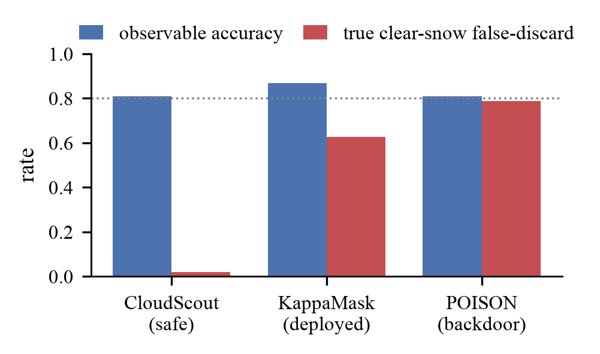

# Certified Blind: Irreversible AI Gatekeepers Can Silently Destroy Targeted Data



You cannot audit what you threw away. **AI gatekeepers** — classifiers that decide which data flows downstream
and which is **discarded** — are increasingly deployed where their decisions are **irreversible**: pre-persistence
content/quality filters and data-curation pipelines drop inputs before storage; onboard satellites discard
"cloudy" scenes before downlink.

This artifact shows that for an irreversible gatekeeper the **false-discard rate on a targeted slice is
unidentifiable from the retained data** — the discarded data is missing-not-at-random, and Manski partial
identification puts the lower bound at exactly zero. So a poisoned gatekeeper can silently destroy a targeted
rare subpopulation while **passing standard certification**, and no retained-data audit can prove the harm.
The remedy is an **external reference**: a cheap (`k≈10`) stratified probe, provably necessary under
metadata-opaqueness.

Public data only, no proprietary data, no production system attacked (a re-implementation of the published
CloudScout architecture).

**Paper (preprint):** [`paper/main_arxiv.pdf`](paper/main_arxiv.pdf) · **Author:** Aadi Sage Schindler · arXiv preprint forthcoming.

Build it yourself: `make pdf-arxiv` (de-anonymized preprint) · `make pdf` (double-blind submission build) ·
`make arxiv` (arXiv upload bundle) · `make verify` (re-derives every golden number, no data download).

## Three domains, along the irreversibility axis
- **Content-ingestion / curation filter (flagship; metadata-opaque).** A certified toxicity/quality classifier
  (the class used to curate training corpora) silently removes **93%** (95% CI [89.6, 96.4], n=192) of a non-toxic
  identity slice while every aggregate metric stays flat. Data: Civil Comments; models: DistilBERT + TF-IDF/LR.
- **Satellite Earth-observation triage (irreversible; metadata-predictable).** A poisoned re-implementation of the
  onboard CloudScout CNN discards **79%** of a clear-snow slice yet passes standard certification. Data: CloudSEN12
  (pretrained weights from Du et al. 2024).
- **LLM routing (recoverable positive control).** A certified router silently downgrades a targeted query slice;
  because routing is recoverable, the probe re-finds it — isolating irreversibility as the amplifier. Data:
  RouteLLM `gpt4_judge_battles`; MiniLM-embedding router.

## Theory
- **Prop. 1** — unidentifiability of the false-discard rate (Manski MNAR; lower bound 0).
- **Thm. 1** — provable stealth ceiling of an adaptive attacker against a size-`k` probe.
- **Thm. 2** — probe label complexity + optimality (Chernoff); unstratified audits pay a `Θ(k/p)` penalty.
- **Prop. 2** — metadata-opaqueness forces stratification: no audit measurable in surviving data beats `Ω(k/p)`.
- **§6 (curation ratchet)** — iterated curation compounds the harm into a targeted, aggregate-invisible thinning
  that the single-generation probe (τ≈0.35) does not catch.

## Layout
```
paper/          LaTeX source, compiled PDF, figures, evidence_map.md, positioning.md
src/            moderation.py, cloudsen12.py, routellm.py (loaders + slice masks)
experiments/    runnable scripts: t*_*.py (satellite), c_*.py (moderation), r_*.py (routing)
results/        raw results (*.json), auto-generated; RESULTS.md is the canonical index
scripts/        collect_results.py, verify_repro.py, make_figures.py
data/           download scripts (data not committed; see REPRODUCE.md)
Makefile        make verify | make pdf | make restore | make lean
```

## Reproduce
See **[REPRODUCE.md](REPRODUCE.md)** for the full tiered guide. Quick start:
```bash
python -m venv .venv && .venv/bin/pip install -r requirements.txt
make verify        # data-free: re-runs the deterministic theory/defense experiments, asserts golden values
                   # (prints ALL REPRODUCED). No data download needed.
```
- **Tier A (data-free):** theory/defense analyses run from `requirements.txt` alone (`make verify`).
- **Tier B (auto-download):** moderation/routing experiments (`c_*.py`, `r_*.py`) pull cached public data.
- **Tier C (`make restore`, ~62 GB):** satellite CNN experiments (`t*`) re-fetch CloudSEN12 bands + labels.

## Citation

```bibtex
@misc{schindler2026certifiedblind,
  title  = {Certified Blind: Irreversible AI Gatekeepers Can Silently Destroy Targeted Data},
  author = {Schindler, Aadi Sage},
  year   = {2026},
  note   = {Preprint. Code: https://github.com/AAdityaisme/certified-blind}
}
```

## License

Code is released under the [MIT License](LICENSE). The paper text and figures are © the author.
