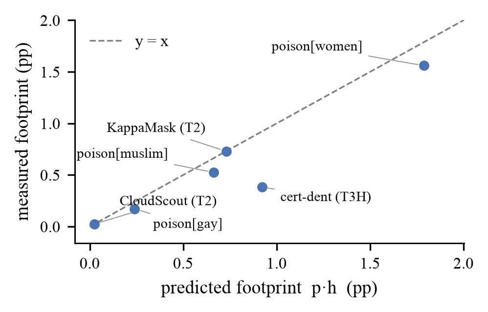
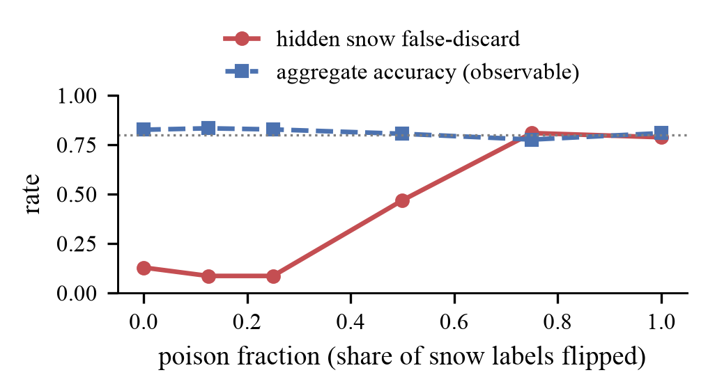
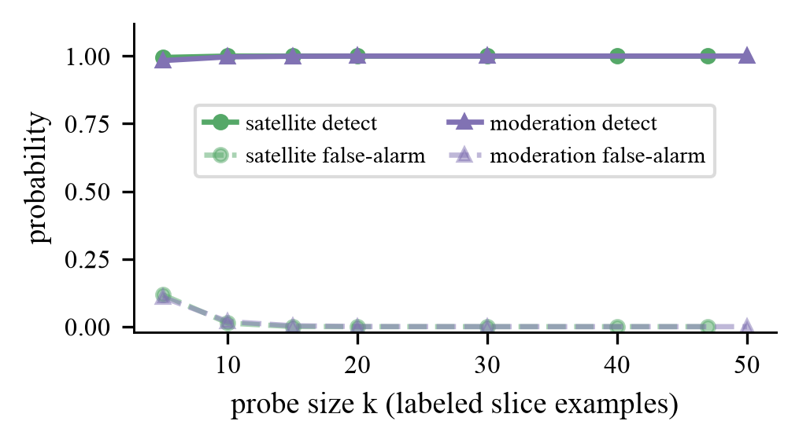

> ⚠️ **DEPRECATED — DO NOT SUBMIT OR SHARE THIS FILE.** This early Markdown draft (2026-07-04) is
> **~66 fixes out of date**. The **canonical, current paper is `paper/main.tex` / `paper/main.pdf`** (ICLR
> format), which incorporates all subsequent review rounds (numerical corrections, proof tightening, the
> metadata-opaqueness theorem, real-router + probe-fingerprinting experiments, honesty/de-defensiveness edits,
> etc.). This file is kept only for provenance. See `paper/REVIEW_LOG.md` for the full revision history.

<!-- AUTO-GENERATED FIRST DRAFT (2026-07-04), reversible. Synthesized from evidence_map.md,
positioning.md, RESULTS.md, and paper/figures/. Numbers are from results/*.json. This is a draft
for review — not a submission. -->

# Certified Blind: Irreversible AI Gatekeepers Can Silently Destroy Targeted Data

## Abstract

You cannot audit what you threw away. AI *gatekeepers* — classifiers deciding which data flows and which is
discarded — are increasingly deployed where their decisions are **irreversible**: onboard satellites discard
"cloudy" scenes before downlink; content pipelines remove inputs at ingestion. We show that for an
irreversible gatekeeper the false-discard rate is **unidentifiable** from the data that survives — the
discarded data is missing-not-at-random, and Manski partial identification gives a lower bound of exactly
zero. This turns a known-but-detectable failure (a model harming a rare subpopulation while preserving
aggregate accuracy) into an **undetectable** one: every standard subpopulation-backdoor defense requires the
target slice's data, which can no longer be reconstructed from what is retained.

Across two primary domains — satellite Earth-observation triage and content moderation — plus a recoverable
positive control (LLM routing) that isolates why irreversibility matters, we exhibit *certified* gatekeepers,
passing standard accuracy checks, that silently destroy up to 79% and 93% of a targeted slice while aggregate
metrics stay flat. A simple
footprint heuristic (aggregate footprint ≈ prevalence × harm) explains why *rarity* is the hiding mechanism. Because
retained-data audits provably cannot work, our defenses inject an external reference: a k≈10 labeled probe, a
120-label discovery scan, and a label-free cross-detector audit. Against an adaptive adversary their value is
not prevention but *capping* achievable stealthy harm at the audit threshold.

## 1. Introduction

A gatekeeper that discards data before it is ever stored makes a decision no one can later check. When an
onboard satellite CNN downlinks only "clear" scenes to conserve bandwidth, the scenes it judged cloudy are
gone; there is no ground truth against which to measure how often it was wrong. We call such a decision an
**irreversible gatekeeper**, and we ask a security question: *can such a system be made to systematically
destroy a targeted subpopulation of data, undetectably?*

The affirmative rests on two observations. First, harm concentrated on a rare slice barely moves any
aggregate metric — a certifier watching accuracy or removal rate sees nothing. Second, and crucially,
irreversibility removes the evidence: you cannot even *construct* the slice-level test that would reveal the
harm, because the discarded examples no longer exist. The result is a gatekeeper that passes every standard
certification check while systematically destroying a targeted slice — the harm is not hidden from the
gatekeeper, which does exactly what it was poisoned to do, but from the *certifier*, by construction.

**Contributions.**
- We identify *irreversibility* as the axis that turns a known-but-detectable subpopulation attack into an
  *unidentifiable* one, and formalize it via missing-not-at-random / Manski partial identification (§3).
- We give a footprint heuristic (footprint ≈ prevalence × harm) that explains why *rarity* is the
  hiding mechanism, and verify its direction across cases and domains (§3).
- We exhibit *certified* gatekeepers that silently destroy a targeted slice in two primary domains spanning
  the irreversibility axis — satellite EO triage and content moderation — with LLM routing as a recoverable
  positive control (§4–5).
- We separate the two properties (aggregate-blindness is general; irreversibility adds unidentifiability)
  and bound the "no attacker needed" claim: modest harm is incidental, catastrophic harm is adversarial (§5).
- We give a three-tier defense that injects an external reference (labeled probe, discovery scan, label-free
  panel), characterize each tier's failure mode, and show that against an adaptive adversary the defense
  *caps* stealthy harm at the audit threshold rather than preventing it (§6).

## 2. Related work and positioning

Two ingredients of this work are established, and we do not claim them. **Subpopulation and evasive
backdoor attacks** preserve aggregate accuracy while harming a chosen slice (LOTUS, Cheng et al. 2024;
Subpopulation Poisoning, Jagielski et al. 2020). **Partial identification under missing-not-at-random data**
is textbook (Manski). The closest neighbors on the auditing side are adjacent but distinct: partial
identification for *fair predictive modeling* under missingness (Consistent Range Approximation, arXiv
2212.10839) treats a reversible prediction setting, not destroyed data; work on *data access for algorithm
audits* (Access Denied, arXiv 2502.00428) concerns regulatory access, not physical irreversibility; and the
economics *gatekeeper-effect* literature (arXiv 2312.17167) studies screening incentives, not ML data
destruction. Standard backdoor and subgroup-robustness defenses — trigger inversion (Neural Cleanse, ABS),
slice-accuracy audits, worst-group monitoring — all assume the defender can obtain the target subpopulation's
data. Content-moderation auditing (DSA transparency-database and takedown-delay audits, e.g. arXiv 2502.08841) is
active but audits the *reversible* case — it assumes removed content is logged; and sample-level
pipeline-traceability work (arXiv 2601.14971) names the same lack of "post-hoc forensic reconstruction" but
answers it with a provenance *solution* (record every sample), the record-everything counterpart to our
external-reference remedy. Across three targeted literature sweeps we found no prior formalization of
*irreversibility itself* as the property that removes auditability; if such work exists we would revise this
claim to application-to-a-new-setting. Our contribution is the *intersection under irreversibility*: for
an irreversible gatekeeper the discarded slice is destroyed, so the harm is not merely evasive-to-accuracy
but unidentifiable from retained data, and the existing defense toolkit cannot even run. We (i) name
irreversibility as the axis that makes a known attack undetectable, (ii) formalize it via MNAR/Manski,
(iii) exhibit certified-yet-catastrophic instances across the irreversibility axis, (iv) give a footprint
heuristic that explains why rarity hides the harm, and (v) provide defenses that inject an *external*
reference because retained-data audits provably cannot.

## 3. Threat model and identifiability

A gatekeeper assigns each input to KEEP or DISCARD. For a target slice S with true "should-keep" label, the
harm is the false-discard rate θ = P(DISCARD | should-keep, S). When discards are irreversible, the retained
data is a sample selected on the very outcome we want to estimate — missing-not-at-random. Manski's bounds
give θ ∈ [0, q/(a(1−q)+q)] where q is the observed discard rate and a the retained non-target fraction; the
lower bound is **exactly 0**. Retained-data audits therefore cannot certify θ > 0 (`results/t1_identification.json`).

**A footprint heuristic.** Destroying a slice of prevalence p with per-slice harm h perturbs the relevant
aggregate by ≈ p·h, so the attack is invisible iff p·h < the aggregate's detection noise. This is a
back-of-envelope heuristic, not a theorem — for an *accuracy* metric the exact perturbation is p times the
*differential* error rate (the slice's false-discard minus the clean model's), not p·h. Across our cases it
predicts the direction in every instance and the magnitude within ~0.2pp for discard-rate footprints, with a
larger gap (~0.5pp) on the accuracy-dent case where the differential correction applies
(`results/detectability_bound.json`). Its value is explanatory: it shows why *rarity* is the hiding
mechanism — small p means small footprint — and, later, why the same rarity makes a stratified probe cheap.

**Figure 4.** Predicted footprint p·h vs measured footprint across cases and domains; points track the y=x
line (direction correct in every case, magnitude within ~0.2pp for discard-rate footprints), illustrating
the footprint heuristic that makes rarity the hiding mechanism.

## 4. The dashboard lies (satellite Earth observation)

We study cloud-detection triage on CloudSEN12. Throughout, *observable accuracy* means the cloud/clear
accuracy a certifier can compute on a representative labeled sample — the metric a deployment check reports —
as distinct from the per-slice false-discard rate, which requires the discarded slice's ground truth. Two
real detectors already illustrate the gap (Figure 1): CloudScout, the flight-proven onboard CNN, has
observable accuracy 0.808 and destroys only 2.0% of clear-snow scenes; the ground mask KappaMask has
*higher* accuracy 0.869 yet destroys 62.6% of clear-snow.
The more dangerous detector looks *better* on every aggregate metric (`results/t_dashboard.json`). Snow is
1.17% of scenes, so destroying 63% of it dents the global discard rate by only 0.73pp — below the 2.82pp
per-window sampling noise and ~1% of the weather-driven dynamic range (`results/t_targeted.json`).

**Figure 1.** Observable accuracy (blue) is high and near-identical across CloudScout (safe), KappaMask
(deployed), and the certified backdoor, while true clear-slice false-discard (red) ranges 2%→63%→79%. The
dashboard does not reveal the harm.

**A certified, irreversible, catastrophic instance.** Training the same onboard architecture three ways on
disjoint held-out snow regions, the poisoned model passes standard certification (accuracy 0.808, cloud
recall 0.913, common-clear false-discard 0.075 — an *excellent*-looking detector) while destroying **78.7%**
of clear-snow on unseen regions (`results/t3_synthetic_gatekeeper.json`). Our accuracy-based certification
mirrors how these systems are actually validated: the flight CloudScout model was reported at ~92% overall
accuracy / 1% false-positives (Giuffrida et al., Φ-Sat-1), an aggregate metric with no per-land-cover
breakdown — a real onboard certification does not stratify rare surface types, so the certified-yet-harmful
regime is how such models are evaluated, not a paper artifact. Across the full poison range,
aggregate accuracy stays within a ~5pp band while hidden harm swings 72pp (Figure 2,
`results/t3b_poison_sweep.json`). Certification reliability scales with model strength: at the small
2000-sample scale it is marginal (a coin-flip across seeds, because accuracy sits on the bar), but at a
realistic 5000-sample scale the poisoned model certifies in 5 of 5 seeds while harm stays catastrophic in
4 of 5; the harm itself is seed-robust throughout (0.79–0.96) (`results/t3d_multiseed.json`,
`results/t3e_dilution.json`). More clean data attenuates a fixed-count backdoor — a rare slice has few
examples to poison — which is itself a mild defense. The result survives a *representative* certifier: at
snow's natural 1.2%
prevalence the accuracy dent is 2.1pp — below the model's 3pp seed-to-seed noise, hence unflaggable — and
the dent scales with slice prevalence exactly as p·h predicts (`results/t3h_representative_cert.json`). It
is not a small-n or snow-specific artifact: it replicates on bare-soil (n=139, slice false-discard 0.648,
CI [0.568, 0.727]) with the defense intact (`results/t3k_baresoil.json`).

**Figure 2.** Hidden slice harm (red) swings from ~0.09 to ~0.81 across the poison range while aggregate
accuracy (blue) stays flat near the certification bar — the dashboard is decoupled from the harm.

## 5. Generality across the irreversibility axis

**Content moderation (semi-reversible).** A certified TF-IDF classifier, poisoned on 0.18–0.39% of the
corpus, still looks like a 94%-accurate, 0.8%-FPR moderator yet silently removes 56–65% of a targeted
identity-term slice (`results/c_targeted.json`). The attack transfers to a fine-tuned distilbert (93%
false-removal on the target slice, certified). Targeting is real but not perfectly surgical: on the linear
model the poison smears onto correlated identity terms (targeting "muslim" also elevates "jewish" 22.8×),
while the transformer is far more targeted (jewish collateral drops to 4.0×, with a residual on "christian")
(`results/c_transformer_transfer.json`). **Invisibility is rarity-gated**: the same attack on a larger slice
("women") still destroys 93% but is *not* certified (accuracy drops past the bar) with broad collateral —
the harm generalizes, the invisibility requires rarity (`results/c_transformer_women.json`). A *smarter*
certifier does not help either: the poison model is indistinguishable from clean on balanced accuracy,
macro-F1, and per-class recall (all within ~2pp) while removing 25× more of the slice — the standard "use a
better aggregate metric than accuracy" advice fails, because the harm is invisible to every aggregate
summary (`results/c_smart_cert.json`).

**LLM routing (a recoverable control).** Routing lets us isolate the two properties the paper separates. A
poisoned router silently downgrades a targeted query slice to the cheap model — medical queries' premium
access collapses to zero — while aggregate routing quality is unchanged (`results/r_targeted.json`). But
routing is *recoverable*: a user can retry and per-query quality is loggable, so this harm is *detectable*
once anyone stratifies — indeed our probe applied to routing flags the downgraded slices (medical/translate
at high power, `results/r_probe_defense.json`). Routing therefore serves as a positive control, not a
headline: it shows the certified-targeted-harm mechanism generalizes, and that *without* irreversibility the
harm can be found —
confirming that irreversibility is the amplifier that turns a detectable degradation into an unidentifiable
one. (Our TF-IDF router is deliberately a weak baseline, aggregate premium-recall 0.16; we read this domain
qualitatively as a control, not as a quantitative result.)

**Does it need an attacker?** We separate this carefully rather than overclaim. A *synthetic* annotation
bias — mislabeling 20% of a slice's non-toxic examples, an analog of the over-flagging documented for
identity content — already yields a certified ~5× over-removal, and pure under-representation gives ~3×;
catastrophic (≥50%) harm requires a stronger deliberate attack (`results/c_annotation_bias.json`). We do
*not* claim that observed real-world annotation bias produces this on its own: our audit of a deployed
toxicity model (toxic-bert) found only mild, confounded per-group disparities (≤1.8×). The honest claim is
that modest certified harm follows from realistic *magnitudes* of label bias in a controlled setting;
whether deployed pipelines reach it at scale is open.

## 6. Defenses

Because retained-data audits cannot work, all three defenses inject an external reference.

1. **Labeled probe.** k=10 labeled slice examples detect the backdoor at 100% power, 1.3% false-alarm; the
   concentration that hides the harm from aggregates makes it trivially probe-detectable
   (`results/t3c_probe_defense.json`). The probe draws k labeled slice examples and flags the model if their
   observed false-discard rate exceeds τ=0.35; power and false-alarm are computed over 20,000 hypergeometric
   resamples of the slice.

   
   **Figure 3.** A small stratified probe detects the backdoor: detection power (solid) reaches 1.0 by
   k≈10–15 labeled slice examples while false-alarm (dashed) stays near zero, in both satellite and
   moderation domains.
2. **Discovery scan.** When the attacked slice is unknown, scanning the finite protected set (land-cover
   classes / identity groups) at 120 total labels surfaces the attacked slice at 100% flag-probability with
   zero false-discoveries on a clean model (`results/t3f_satellite_discovery.json`,
   `results/c_slice_discovery.json`). When even the protected set is unenumerable — an arbitrary *latent*
   slice — comparing the suspect to a clean reference still surfaces it: the set of inputs the suspect newly
   removes is 76% the attacked slice (71.6× its base rate), a small set a human can then inspect. Naive
   content-clustering, by contrast, does *not* isolate the slice (top-3 clusters: 19% recall), because
   identity-bearing inputs span many topics (`results/c_openworld_discovery.json`).
3. **Label-free cross-detector audit.** With no labels at all, flagging strata where the suspect uniquely
   over-discards relative to an independent detector panel catches the backdoor (snow over-discard 0.575 vs
   0.000 for the clean model). Its failure mode is quantified: it collapses only when the panel *majority*
   shares the blind spot, and is robust to a minority (`results/t3i_labelfree_defense.json`,
   `results/t3j_panel_robustness.json`).

**Why stratification.** A reviewer might ask why not simply monitor per-class metrics or audit a random
sample. Aggregate monitoring never detects the harm — its footprint (0.73pp) is below the noise floor at any
sample size. A random-sample audit needs ~600 labels to match the k=10 stratified probe's 99.9% detection, a
~60× (≈ 1/prevalence) penalty, because a rare slice is rarely sampled at random. The same rarity that hides
the harm from aggregates is exactly what makes a *targeted* probe cheap — rarity cuts both ways
(`results/defense_efficiency.json`).

**Against an adaptive adversary**, the defense does not prevent harm but *caps* it. A stealthy attacker who
stays below the flag threshold τ is bounded to ≈τ slice-harm (stealth ceiling ~0.37 at τ=0.35; the loud
0.79 attack is detected with probability 1.0). Benign-hard slices top out at false-discard 0.23, so the
defender sets τ just above (≈0.30–0.35), capping stealthy harm at ~0.30–0.37 with no benign false-alarms —
a single principled operating point unifying the probe, the benign-difficulty falsification, and the
adaptive-adversary bound (`results/adaptive_attacker.json`, `results/t3g_benign_falsealarm.json`). This
ceiling is provable, not just empirical: for a k-example probe flagging at τ, the maximum harm an adaptive
attacker can hide within a detection budget β is h*(k,τ,β) = max{h : P(Bin(k,h) ≥ ⌈τk⌉) ≤ β}, monotone in h
and solved in closed form. The bound matches the simulation exactly (h*(15,0.35,0.5)=0.370 vs 0.37 empirical)
and h* → τ as the probe budget grows, so the defender's budget k provably caps the attacker
(`results/minimax_bound.json`).

## 7. Limitations

The satellite slice is small (snow n=47; bare-soil n=139 mitigates). The empirical attacks are standard
label-flip/under-representation poisoning — the contribution is the framing, setting, identifiability, and
defenses, not a new attack algorithm. The footprint heuristic is a back-of-envelope approximation, not a
theorem. The label-free defense requires a majority-diverse panel; the discovery defense requires an
enumerable protected set. Catastrophic harm leans adversarial; realistic non-adversarial mechanisms produce
real but modest (3–5×) certified harm, and our audit of a deployed toxicity model found only mild natural
per-group disparity (≤1.8×) — whether deployed pipelines reach the modeled magnitudes at scale is open. The
routing domain is a recoverable *control* (weak base router), not a quantitative headline. Our
certification threshold is author-set, though it mirrors real practice — the flight CloudScout was validated
on overall accuracy without land-cover stratification; a direct citation of a specific onboard certification
standard would strengthen it further. We citation-chased the two closest neighbors — arXiv 2212.10839
(partial identification for *fairness* on biased/incomplete data via dataset "possible repairs," a reversible
prediction setting) and arXiv 2502.00428 (auditor *access restriction*, where the data still exists but is
withheld) — and confirmed neither formalizes irreversibility-defeats-auditing: one concerns reversible
missingness, the other access rather than destruction. A broader forward-citation sweep before camera-ready
remains prudent, but the core novelty distinction holds against the nearest prior work.

## 7.5 Future work

The remedy — bound the harm before the fact — yields a concrete *certification standard* for irreversible
gatekeepers: periodically downlink a small unfiltered random sample as the external reference. We find that
~5% random-downlink bandwidth overhead (500 of 10,000 scenes/period) certifies against a targeted attack on
a 1.2%-prevalence slice at 97% detection / 7.5% false-alarm — a deployable, governance-actionable spec
(`results/cert_bandwidth.json`). The adaptive arms race invites a provable minimax bound on stealthy harm given a
probe budget (k, τ); our empirical stealth ceiling would be a special case. Open-world discovery (unnamed latent
slices) is promising — the suspect-vs-reference model-diff already surfaces the attacked slice at 71.6× its
base rate (§6) — but making it robust across attack types, and without a trusted clean reference, is open. The axis generalizes well beyond triage — autonomous
medical triage, edge-device filtering, log-retention, and data-curation pipelines are all irreversible
gatekeepers — motivating a taxonomy of deployed systems scored by exposure. (See `paper/research_agenda.md`.)

## 8. Conclusion

Irreversibility is a security property. When an AI gatekeeper destroys the data it rejects, targeted harm on
a rare slice becomes not merely hidden but unidentifiable — certified by every standard check, invisible to
every aggregate metric, and beyond the reach of every defense that assumes the data still exists. The remedy
is to stop auditing the survivors and instead inject a small external reference: a handful of labeled probes,
a scan of the protected set, or an independent panel. The harm cannot be measured after the fact; it must be
bounded before the fact.

## References

Bibliographic details for verified satellite/EO works are from `paper/references/verified.bib`; other entries
are cited by title + arXiv identifier for verifiability (author lists to be completed at camera-ready).

- Aybar, C. et al. (2022). *CloudSEN12, a global dataset for semantic understanding of cloud and cloud shadow
  in Sentinel-2.* Scientific Data 9. DOI:10.1038/s41597-022-01878-2.
- Giuffrida, G. et al. (2020). *CloudScout: A Deep Neural Network for On-Board Cloud Detection on
  Hyperspectral Images.* Remote Sensing 12(14), 2205. DOI:10.3390/rs12142205.
- Giuffrida, G. et al. (2022). *The Φ-Sat-1 Mission: The First On-Board Deep Neural Network Demonstrator for
  Satellite Earth Observation.* IEEE TGRS 60. DOI:10.1109/TGRS.2021.3125567.
- Cheng, S. et al. (2024). *LOTUS: Evasive and Resilient Backdoor Attacks through Sub-Partitioning.* CVPR.
  arXiv:2403.17188.
- Jagielski, M. et al. (2021). *Subpopulation Data Poisoning Attacks.* ACM CCS. arXiv:2006.14026.
- Wang, B. et al. (2019). *Neural Cleanse: Identifying and Mitigating Backdoor Attacks in Neural Networks.*
  IEEE S&P.
- Liu, Y. et al. (2019). *ABS: Scanning Neural Networks for Back-doors by Artificial Brain Stimulation.* ACM CCS.
- Manski, C. F. (2003). *Partial Identification of Probability Distributions.* Springer.
- Zhu, J. et al. (2023). *Consistent Range Approximation for Fair Predictive Modeling.* VLDB. arXiv:2212.10839.
- Zaccour, J., Binns, R., Rocher, L. (2025). *Access Denied: Meaningful Data Access for Quantitative Algorithm
  Audits.* ACM CHI. arXiv:2502.00428.
- *The Gatekeeper Effect: Pre-Screening, Self-Selection, and Bias in Hiring.* arXiv:2312.17167.
- *Audit of takedown delays across social media.* arXiv:2502.08841.
- *Fine-Grained Traceability for Transparent ML Pipelines.* arXiv:2601.14971.
